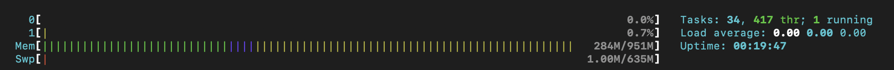
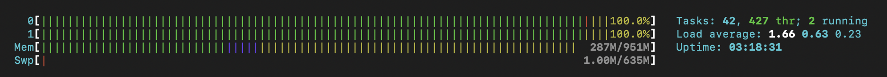

# Task 003 - Test and validate the elasticity


## Simulate heavy load to trigger a scaling action

* [Install the package "stress" on your Drupal instance](https://www.geeksforgeeks.org/linux-stress-command-with-examples/)

* [Install the package htop on your Drupal instance](https://www.geeksforgeeks.org/htop-command-in-linux-with-examples/)

* Check how many vCPU are available (with htop command)

```
[INPUT]
htop

[OUTPUT]
//copy the part representing vCPus, RAM and swap usage
2 vCPUs
```


### Stress your instance

```
[INPUT]
//stress command
stress -c 2

[OUTPUT]
//copy the part representing vCPus, RAM and swap usage
//tip : use two ssh sessions....
```


* (Scale-IN) Observe the autoscaling effect on your infa


```
[INPUT]
//Screen shot from cloud watch metric
```


```
//Screenshot of ec2 instances list (running state)
```


```
//Validate that the various instances have been distributed between the two available az.
[OUTPUT]
```


```
//Screenshot of the activity history
```
[ACTIVITY_LAUNCH](./img/DEVOPS03/CLD_AWS_ASG_ACTIVITY_HISTORY_LAUNCH.PNG)

```
//Screenshot of the cloud watch alarm target tracking
```


* (Scale-OUT) As soon as all 4 instances have started, end stress on the main machine.

[Change the default cooldown period](https://docs.aws.amazon.com/autoscaling/ec2/userguide/ec2-auto-scaling-scaling-cooldowns.html)

```
//Screenshot from cloud watch metric
```


```
//Screenshot of ec2 instances list (terminated state)
```


```
//Screenshot of the activity history
```


## Release Cloud resources

Once you have completed this lab release the cloud resources to avoid
unnecessary charges:

* Terminate the EC2 instances.
    * Make sure the attached EBS volumes are deleted as well.
* Delete the Auto Scaling group.
* Delete the Elastic Load Balancer.
* Delete the RDS instance.

(this last part does not need to be documented in your report.)

## Delivery

Inform your teacher of the deliverable on the repository (link to the commit to retrieve)