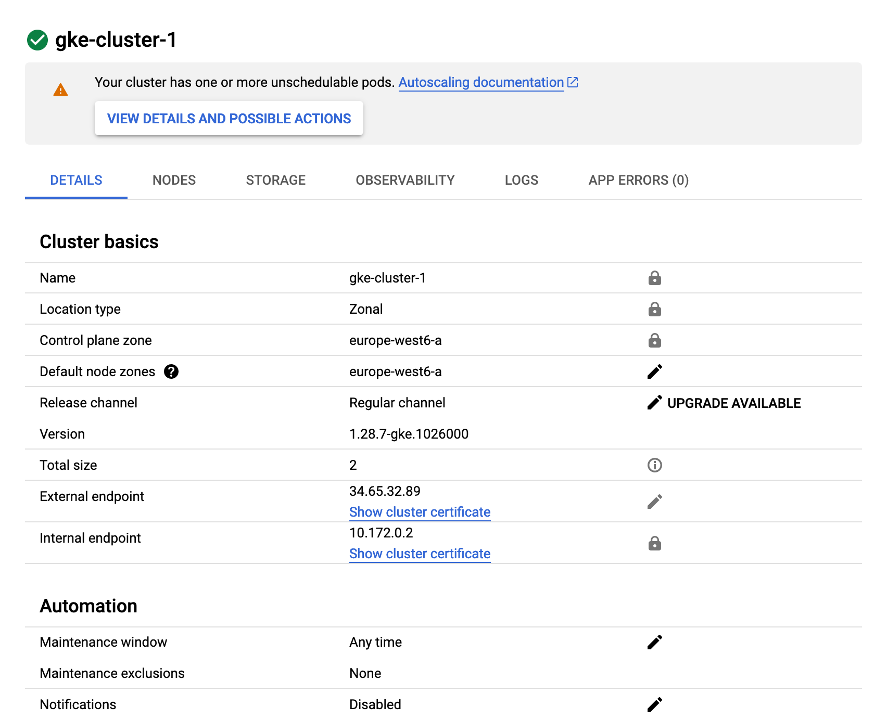

# Task 2 - Deploy the application in Kubernetes Engine

In this task you will deploy the application in the public cloud service Google Kubernetes Engine (GKE).

## Subtask 2.1 - Create Project

Log in to the Google Cloud console at <http://console.cloud.google.com/>, navigate to the __Resource Manager__ (<https://console.cloud.google.com/cloud-resource-manager>) and create a new project. 

## Subtask 2.2 - Create a cluster

Go to the Google Kubernetes Engine (GKE) console (<https://console.cloud.google.com/kubernetes/>). If necessary, enable the Kubernetes Engine API. Then create a cluster. 

* Choose a __GKE Standard__ cluster. (Please ensure that you are not using the Autopilot. The button to switch to Standard could be a bit tricky to find...)
* Give it a __name__ of the form _gke-cluster-1_
* Select a __region__ close to you.
* Set the __number of nodes__ to 2. 
* Set the __instance type__ to micro instances.
* Set the __boot disk size__ to 10 GB.
* Keep the other settings at their default values.

## Subtask 2.3 - Deploy the application on the cluster

Once the cluster is created, the GKE console will show a __Connect__ button next to the cluster in the cluster list. Click on it. A dialog will appear with a command-line command. Copy/paste the command and execute it on your local machine. This will download the configuration info of the cluster to your local machine (this is known as a _context_). It also changes the current context of your `kubectl` tool to the new cluster.

To see the available contexts, type :

```sh
$ kubectl config get-contexts
```

You should see two contexts, one for the Minikube cluster and one for the GKE cluster. The current context has a star `*` in front of it. The `kubectl` commands that you type from now on will go to the cluster of the current context.

With that you can use `kubectl` to manage your GKE cluster just as you did in task 1. Repeat the application deployment steps of task 1 on your GKE cluster.

Should you want to switch contexts, use :

```sh
$ kubectl config use-context <context>
```

## Subtask 2.4 - Deploy the ToDo-Frontend Service

On the Minikube cluster we did not have the possibility to expose a service on an external port, that is why we did not create a Service for the Frontend. Now, with the GKE cluster, we are able to do that.

Using the `redis-svc.yaml` file as an example, create the `frontend-svc.yaml` configuration file for the Frontend Service.

Unlike the Redis and API Services the Frontend needs to be accessible from outside the Kubernetes cluster as a regular web server on port 80.

  * We need to change a configuration parameter. Our cluster runs on the GKE cloud and we want to use a GKE load balancer to expose our service.
  * Read the section "Publishing Services - Service types" of the K8s documentation 
    <https://kubernetes.io/docs/concepts/services-networking/service/#publishing-services-service-types>
  * Deploy the Service using `kubectl`.

This will trigger the creation of a load balancer on GKE. This might take some minutes. You can monitor the creation of the load balancer using `kubectl describe`.

### Verify the ToDo application

Now you can verify if the ToDo application is working correctly.

  * Find out the public URL of the Frontend Service load balancer using `kubectl describe`.
  * Access the public URL of the Service with a browser. You should be able to access the complete application and create a new ToDo.


## Deliverables

Document any difficulties you faced and how you overcame them. Copy the object descriptions into the lab report (if they are unchanged from the previous task just say so).

> La seule difficulté mineure rencontrée pendant cette partie est le fait que le gcloud cli s'installe de manière portable dans le répertoire courant. Je l'avais donc supprimé sans faire exprès car il était dans mon dossier Downloads. J'ai donc dû le réinstaller. Sinon tout s'est bien passé.

```yaml
# frontend-svc.yaml
apiVersion: v1
kind: Service
metadata:
  name: frontend-svc
  labels:
    component: frontend
    app: todo
spec:
  ports:
  - port: 80
    targetPort: 8080
    name: frontend
  selector:
    app: todo
    component: frontend
  type: LoadBalancer
```

Take a screenshot of the cluster details from the GKE console. Copy the output of the `kubectl describe` command to describe your load balancer once completely initialized.



```````
$ kubectl describe services
Name:              api-svc
Namespace:         default
Labels:            app=todo
                   component=api
Annotations:       cloud.google.com/neg: {"ingress":true}
Selector:          app=todo,component=api
Type:              ClusterIP
IP Family Policy:  SingleStack
IP Families:       IPv4
IP:                10.76.170.167
IPs:               10.76.170.167
Port:              api  8081/TCP
TargetPort:        8081/TCP
Endpoints:         10.32.1.10:8081
Session Affinity:  None
Events:            <none>


Name:                     frontend-svc
Namespace:                default
Labels:                   app=todo
                          component=frontend
Annotations:              cloud.google.com/neg: {"ingress":true}
Selector:                 app=todo,component=frontend
Type:                     LoadBalancer
IP Family Policy:         SingleStack
IP Families:              IPv4
IP:                       10.76.162.118
IPs:                      10.76.162.118
LoadBalancer Ingress:     34.65.144.165
Port:                     frontend  80/TCP
TargetPort:               8080/TCP
NodePort:                 frontend  31987/TCP
Endpoints:                10.32.0.6:8080
Session Affinity:         None
External Traffic Policy:  Cluster
Events:
  Type    Reason                Age   From                Message
  ----    ------                ----  ----                -------
  Normal  EnsuringLoadBalancer  47s   service-controller  Ensuring load balancer
  Normal  EnsuredLoadBalancer   6s    service-controller  Ensured load balancer


Name:              kubernetes
Namespace:         default
Labels:            component=apiserver
                   provider=kubernetes
Annotations:       <none>
Selector:          <none>
Type:              ClusterIP
IP Family Policy:  SingleStack
IP Families:       IPv4
IP:                10.76.160.1
IPs:               10.76.160.1
Port:              https  443/TCP
TargetPort:        443/TCP
Endpoints:         10.172.0.2:443
Session Affinity:  None
Events:            <none>


Name:              redis-svc
Namespace:         default
Labels:            component=redis
Annotations:       cloud.google.com/neg: {"ingress":true}
Selector:          app=todo,component=redis
Type:              ClusterIP
IP Family Policy:  SingleStack
IP Families:       IPv4
IP:                10.76.173.254
IPs:               10.76.173.254
Port:              redis  6379/TCP
TargetPort:        6379/TCP
Endpoints:         10.32.1.8:6379
Session Affinity:  None
Events:            <none>
```````