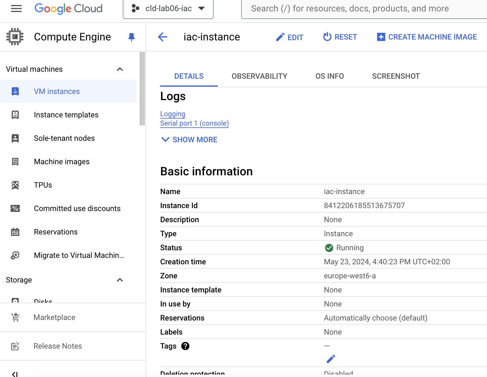

# Task 2: Create a cloud infrastructure on Google Compute Engine with Terraform

In this task you will create a simple cloud infrastructure that consists of a single VM on Google Compute Engine. It will be
managed by Terraform.

This task is highly inspired from the following guide: [Get started with Terraform](https://cloud.google.com/docs/terraform/get-started-with-terraform).

Create a new Google Cloud project. Save the project ID, it will be used later.

* Name: __labgce__

As we want to create a VM, you need to enable the Compute Engine API:

* [Navigate to google enable api page](https://console.cloud.google.com/flows/enableapi?apiid=compute.googleapis.com)


Terraform needs credentials to access the Google Cloud API. Generate and download the Service Account Key:

* Navigate to __IAM & Admin__ > __Service Accounts__. 
* Click on the default service account > __Keys__ and __ADD KEY__ > __Create new key__ (JSON format). 
* On your local machine, create a directory for this lab. In it, create a subdirectory named `credentials` and save the key under the name `labgce-service-account-key.json`, it will be used later.

Generate a public/private SSH key pair that will be used to access the VM and store it in the `credentials` directory:

    ssh-keygen \
      -t ed25519 \
      -f labgce-ssh-key \
      -q \
      -N "" \
      -C ""

At the root of your lab directory, create a `terraform` directory and get the [backend.tf](./appendices/backend.tf), [main.tf](./appendices/main.tf), [outputs.tf](./appendices/outputs.tf) and [variables.tf](./appendices/variables.tf) files. 

These files allow you to deploy a VM, except for a missing file, which you have to provide. Your task is to explore the provided files and using the [Terraform documentation](https://www.terraform.io/docs) understand what these files do. 

The missing file `terraform.tfvars` is supposed to contain values for variables used in the `main.tf` file. Your task is to find out what these values should be. You can freely choose the user account name and the instance name (only lowercase letters, digits and hyphen allowed).

You should have a file structure like this:

    .
    ├── credentials
    │   ├── labgce-service-account-key.json
    │   ├── labgce-ssh-key
    │   └── labgce-ssh-key.pub
    └── terraform
        ├── backend.tf
        ├── main.tf
        ├── outputs.tf
        ├── terraform.tfvars
        └── variables.tf

There are two differences between Google Cloud and AWS that you should know about:

1. Concerning the default Linux system user account created on a VM: In AWS, newly created VMs have a user account that is always named the same for a given OS. For example, Ubuntu VMs have always have a user account named `ubuntu`, CentOS VMs always have a user account named `ec2-user`, and so on. In Google Cloud, the administrator can freely choose the name of the user account.

2. Concerning the public/private key pair used to secure access to the VM: In AWS you create the key pair in AWS and then download the private key. In Google Cloud you create the key pair on your local machine and upload the public key to Google Cloud.

The two preceding parameters are configured in Terraform in the `metadata` section of the `google_compute_instance` resource description. For example, a user account named `fred` with a public key file located at `/path/to/file.pub` is configured as

    metadata = {
      ssh-keys = "fred:${file("/path/to/file.pub")}"
    }
    
This is already taken care of in the provided `main.tf` file.

You can now initialize the Terraform state:

    cd terraform
    terraform init

[OUTPUT]
```bash
Initializing the backend...

Successfully configured the backend "pg"! Terraform will automatically
use this backend unless the backend configuration changes.

Initializing provider plugins...
- Finding latest version of hashicorp/google...
- Installing hashicorp/google v5.30.0...
- Installed hashicorp/google v5.30.0 (signed by HashiCorp)

Terraform has created a lock file .terraform.lock.hcl to record the provider
selections it made above. Include this file in your version control repository
so that Terraform can guarantee to make the same selections by default when
you run "terraform init" in the future.

Terraform has been successfully initialized!

You may now begin working with Terraform. Try running "terraform plan" to see
any changes that are required for your infrastructure. All Terraform commands
should now work.

If you ever set or change modules or backend configuration for Terraform,
rerun this command to reinitialize your working directory. If you forget, other
commands will detect it and remind you to do so if necessary.
```
    
* What files were created in the `terraform` directory? Make sure to look also at hidden files and directories (`ls -a`).

[OUTPUT]
```bash
.
.
├── .terraform
│   ├── providers
│   │   └── registry.terraform.io
│   │       └── hashicorp
│   │           └── google
│   │               └── 5.30.0
│   │                   └── darwin_arm64
│   │                       ├── LICENSE.txt
│   │                       └── terraform-provider-google_v5.30.0_x5
│   └── terraform.tfstate
├── .terraform.lock.hcl
```

* What are they used for?

|File/FolderName|Explanation|
|:--|:--|
| .terraform.lock.hcl | Used to record the provider version used. this allows to re-use the exact same provider version when running `terraform init` in the future. It avoids discrepancies between "users" as it forces the same version to ve used unless upgraded through a `terraform init -upgrade`. |
| .terraform/providers/registry.terraform.io/hashicorp/google/5.30.0/darwin_arm64/LICENSE.txt | Contains the license information of the provider (Google provider provided by Hashicorp). |
| .terraform/providers/registry.terraform.io/hashicorp/google/5.30.0/darwin_arm64/terraform-provider-google_v5.30.0_x5 | The provider binary file. It is the actual implementation of the Google provider. |


* Check that your Terraform configuration is valid:

```bash
terraform validate
```

[OUTPUT]
```bash
Success! The configuration is valid.
```

* Create an execution plan to preview the changes that will be made to your infrastructure and save it locally:

```bash
terraform plan -input=false -out=.terraform/plan.cache
```

```
 - copy the command result in a file named "planCache.json" and add it to your lab repo.
Since the command output isn't JSON, we copied it to a file named "planCache.txt"
```

* If satisfied with your execution plan, apply it:

```bash
    terraform apply -input=false .terraform/plan.cache
```

```
 - copy the command result in a file name "planCacheApplied.txt"
```

* Test access via ssh

//TODO
[INPUT]
```bash
ssh ansible@34.65.216.43 -i ../credentials/labgce-ssh-key
```

[OUTPUT]
```
The authenticity of host '34.65.216.43 (34.65.216.43)' can't be established.
ED25519 key fingerprint is SHA256:i2/X5VV5w9okYvXrK974Ms7NKq4UkKSFmMbVAKIl7eg.
This key is not known by any other names.
Are you sure you want to continue connecting (yes/no/[fingerprint])? yes
Warning: Permanently added '34.65.216.43' (ED25519) to the list of known hosts.
Welcome to Ubuntu 20.04.6 LTS (GNU/Linux 5.15.0-1060-gcp x86_64)

 * Documentation:  https://help.ubuntu.com
 * Management:     https://landscape.canonical.com
 * Support:        https://ubuntu.com/pro

 System information as of Thu May 23 14:42:03 UTC 2024

  System load:  0.55              Processes:             97
  Usage of /:   19.0% of 9.51GB   Users logged in:       0
  Memory usage: 34%               IPv4 address for ens4: 10.172.0.2
  Swap usage:   0%

Expanded Security Maintenance for Applications is not enabled.

0 updates can be applied immediately.

Enable ESM Apps to receive additional future security updates.
See https://ubuntu.com/esm or run: sudo pro status


The programs included with the Ubuntu system are free software;
the exact distribution terms for each program are described in the
individual files in /usr/share/doc/*/copyright.

Ubuntu comes with ABSOLUTELY NO WARRANTY, to the extent permitted by
applicable law.

ansible@iac-instance:~$ 
```

If no errors occur, you have successfully managed to create a VM on Google Cloud using Terraform. You should see the IP of the Google Compute instance in the console. Save the instance IP, it will be used later.

After launching make sure you can SSH into the VM using your private
key and the Linux system user account name defined in the `terraform.tfvars` file.

Deliverables:

* Explain the usage of each provided file and its contents by directly adding comments in the file as needed (we must ensure that you understood what you have done). In the file `variables.tf` fill the missing documentation parts and link to the online documentation. Copy the modified files to the report.

```
//TODO
```

* Explain what the files created by Terraform are used for.

```
The files created by the init are already documented above.
Here are the files created by the plan command:
.terraform/plan.cache - This is the plan file that contains the changes that will be applied to the infrastructure. It was created only because we used the output flag to save the plan to a file.

Here are the files created by the apply command:
.terraform/terraform.tfstate - This contains the backend configuration for the current working directory. All plan files capture the information in .terraform/terraform.tfstate at the time the plan was created. This helps ensure Terraform is applying the plan to correct set of infrastructure.

If we had a local backend as the default backend provided uses, we would have had a terraform.tfstate file created in the same directory as the main.tf file. This file would have contained the current state of the infrastructure. In our case, this information is stored in a postgres database as we defined in our backend.tf file.
```

* Where is the Terraform state saved? Imagine you are working in a team and the other team members want to use Terraform, too, to manage the cloud infrastructure. Do you see any problems with this? Explain.

```
With a local backend, the state is saved locally on the current working directory. Therefore, it would need to be shared with other team members. this can be problematic since the state may contain sensitive values. It is not recommended to version it (using git for instance). A solution is to use a different backend, a remote backend, as we did. Here we used a postgres database, but other options exists such as S3. This way, the state is stored in a secure location and can be shared with other team members. An addition to this, the state can be locked to prevent multiple users from modifying the infrastructure at the same time.
```

* What happens if you reapply the configuration (1) without changing `main.tf` (2) with a change in `main.tf`? Do you see any changes in Terraform's output? Why? Can you think of examples where Terraform needs to delete parts of the infrastructure to be able to reconfigure it?

```
//TODO
1. Reapply without changing main.tf
google_compute_firewall.http: Refreshing state... [id=projects/cld-lab06-iac/global/firewalls/allow-http]
google_compute_firewall.ssh: Refreshing state... [id=projects/cld-lab06-iac/global/firewalls/allow-ssh]
google_compute_instance.default: Refreshing state... [id=projects/cld-lab06-iac/zones/europe-west6-a/instances/iac-instance]

No changes. Your infrastructure matches the configuration.

Terraform has compared your real infrastructure against your configuration and found no differences, so no changes are needed.

Apply complete! Resources: 0 added, 0 changed, 0 destroyed.

Outputs:

gce_instance_ip = "34.65.216.43"
```

```
2. Reapply with a change in main.tf
google_compute_firewall.http: Refreshing state... [id=projects/cld-lab06-iac/global/firewalls/allow-http]
google_compute_firewall.ssh: Refreshing state... [id=projects/cld-lab06-iac/global/firewalls/allow-ssh]
google_compute_instance.default: Refreshing state... [id=projects/cld-lab06-iac/zones/europe-west6-a/instances/iac-instance]

Terraform used the selected providers to generate the following execution plan. Resource actions are indicated with the following symbols:
  ~ update in-place

Terraform will perform the following actions:

  # google_compute_firewall.http will be updated in-place
  ~ resource "google_compute_firewall" "http" {
        id                      = "projects/cld-lab06-iac/global/firewalls/allow-http"
        name                    = "allow-http"
        # (13 unchanged attributes hidden)

      - allow {
          - ports    = [
              - "80",
            ] -> null
          - protocol = "tcp" -> null
        }
      + allow {
          + ports    = [
              + "8080",
            ]
          + protocol = "tcp"
        }
    }

Plan: 0 to add, 1 to change, 0 to destroy.

Do you want to perform these actions?
  Terraform will perform the actions described above.
  Only 'yes' will be accepted to approve.

  Enter a value: yes 

google_compute_firewall.http: Modifying... [id=projects/cld-lab06-iac/global/firewalls/allow-http]
google_compute_firewall.http: Still modifying... [id=projects/cld-lab06-iac/global/firewalls/allow-http, 10s elapsed]
google_compute_firewall.http: Modifications complete after 12s [id=projects/cld-lab06-iac/global/firewalls/allow-http]

Apply complete! Resources: 0 added, 1 changed, 0 destroyed.

Outputs:

gce_instance_ip = "34.65.216.43"
```

```
Yes, for example if we want to rename the instance, terraform will need to delete it and then recreate it. Same if we want to change the availability zone of the instance. Terraform will need to destroy the instance and recreate it in the new zone. Since it needs to physically be somewhere else, it needs to be destroyed and recreated. Sometimes the API doesn't allow certain changes (e.g. changing the name of a security group with the AWS provider), sometimes the reason behind is physical (e.g. changing the availability zone of an instance).
```

* Explain what you would need to do to manage multiple instances.

```
There are multiple possibilities depending on the use case:
- We can add multiple resource `google_compute_instance` in the main.tf which allows to have multiple instances with different parameters.
- We can use the `count` parameter in the resource if we need several identical instances.
- Another possibility is to define a list of parameters that would be different and use a for_each loop to create the instances using for each a parameter from the list. This would allow to dynamically create some different instances.

```

* Take a screenshot of the Google Cloud Console showing your Google Compute instance and put it in the report.



* Deliver a folder "terraform" with your configuration.